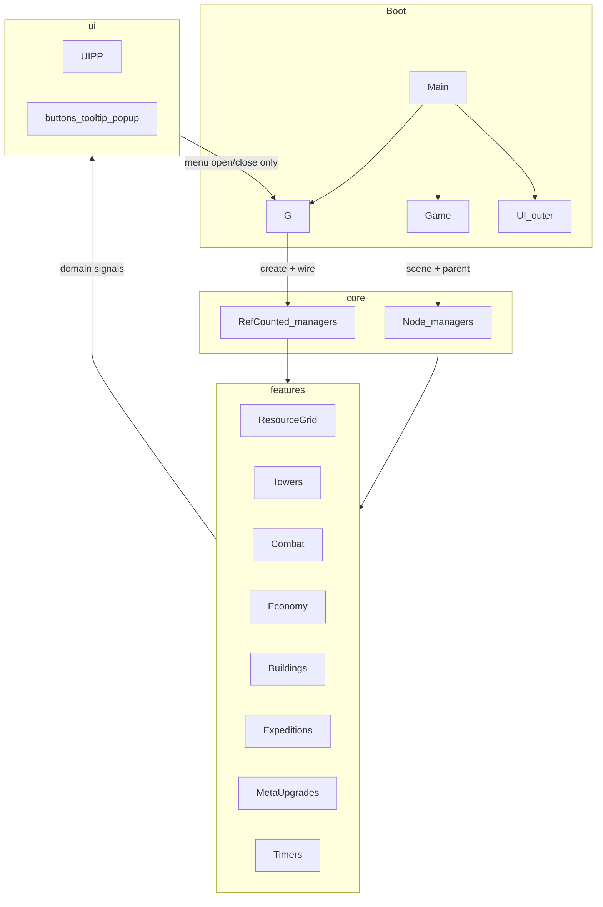

# Architecture Refactor -- Know Where to Put the Next Feature

## Verdict

The game already has the right *shape* (managers, Resources, domain signals, CellManager composition). A prior pass documented in [ARCHITECTURE.md](ARCHITECTURE.md) and the completed [idle_refactor_plan](.cursor/plans/idle_refactor_plan_c3a57792.plan.md) fixed boot opacity and carved up `CellManager`. What still breaks "I know where to put this" is **inconsistent homes for the same kind of thing**, `**G` as god-object + bus + flags**, **dual upgrade/damage models**, and **no conventions doc** that a teammate can follow.

Target: a small-to-medium Godot architecture -- **feature folders, scene co-location, thin autoload, domain signals, Resource-backed data** -- not a DI framework or enterprise layer cake.

---

## Guiding principles (team of 2-3)

1. **One home per kind of thing** -- if two valid places exist, pick one and migrate.
2. **Scene + script together** -- Godot's recommended "assets close to scenes" ([project organization](https://docs.godotengine.org/en/stable/tutorials/best_practices/project_organization.html)).
3. `**G` is wiring, not gameplay** -- composition root + menu/tooltip bus only; gameplay talks through injected managers and domain signals.
4. **Data in Resources, behavior in managers, presentation in UI** -- upgrades/descriptions eventually follow the same rule as cell/projectile `.tres`.
5. **Editor tree = runtime tree** for anything you open often (grids, managers that are Nodes).
6. **Abstractions only when it pays rent** -- no strategy registries, no second autoload per system, no rewrite of working systems "for purity."

---

## Target mental model




**Rule of thumb for new work:**


| New thing                                     | Put it here                                                                  |
| --------------------------------------------- | ---------------------------------------------------------------------------- |
| Grid / tower / expedition / building behavior | Matching `features/<domain>/` folder (scene + script)                        |
| Pure logic with no Node                       | `features/<domain>/` or `core/` if truly cross-cutting                       |
| Tunable numbers / unlocks / descriptions      | `data/<domain>/` as `.tres` + `_scr_*.gd`                                    |
| Menu / HUD / tooltip                          | `ui/`                                                                        |
| Cross-feature event that is *not* UI          | Emit from the owning manager; UI listens                                     |
| Debug cheats                                  | `Main` + InputMap actions, `OS.is_debug_build()` only                        |
| Saveable progress                             | Through `RunState` / save API -- never ad-hoc `user://` from a random script |


---

## Target folder layout

Keep Godot-friendly co-location; stop the split-brain of "sometimes `Scripts/`, sometimes `Scenes/`, sometimes loose `Resources/`."

```text
res://
  core/                    # Boot + thin autoload + shared non-feature utils
    g.gd
    run_state.gd           # Serialisable facade (Phase 5)
    displayable_timer.gd
    hit_circle.gd
  features/
    resource_grid/         # CellManager, CellResource, combat/specials/druid helpers
    towers/                # PlayerCell(Manager), level-upgrade UI+logic
    combat/                # Projectile*, DamageManager, ProjectileManager, modifiers
    economy/               # Economy
    buildings/             # BuildingManager, BuildingCell
    expeditions/           # ExpeditionManager, menus, editor, JSON/rewards
    meta_upgrades/         # UpgradeManager, UpgradeMenu, UpgradeNode
    timers/                # TimerManager, TimerUI, TimerProgressBar
  ui/                      # Cross-feature presentation
    main_hud/              # UI (outer), tooltip
    game_hud/              # UIPP, crit labels
    shared/                # AnimatedButton, PanelButton, NodePopupMenu
  data/                    # All .tres + Resource scripts, mirrored by domain
    resource_cells/
    player_cells/
    projectiles/
    buildings/
    expeditions/
    upgrades/              # Future UpgradeEffect / descriptions
    spawn/
  audio/
  docs/                    # ARCHITECTURE.md, CONVENTIONS.md
  Scenes/Main/             # Keep Main as shell OR move under features/shell/
  Scenes/Game/             # Composition root scene
```

**Migration style:** move one domain per PR (update `preload`/`res://` paths, open scenes in editor once to refresh). Do **not** big-bang rename everything in one commit -- Godot UID/path churn is painful for 2-3 people.

**Default if you prefer less churn:** keep current `Scenes/` + `Scripts/` + `Resources/` names, but enforce the same *logical* map in [CONVENTIONS.md](docs/CONVENTIONS.md) and only move files when touching that domain. The plan below assumes **gradual physical moves** because your primary goal is navigability.

---

## Current pain (ranked)

1. **No "where to put X" map** -- `Scripts/` vs `Scenes/` vs loose Resources; menus split UI/UIPP; managers half in scene, half code-created.
2. `**G` sprawl** (~90+ call sites) -- refs + UI bus + `in_expedition` + highlight labels + dead `cell_hitted`.
3. `**UpgradeManager` as cross-domain hub** -- giant enum + description dict + match touching six managers ([features/meta_upgrades/upgrade_manager.gd](features/meta_upgrades/upgrade_manager.gd)).
4. **Dual systems** -- meta upgrades vs level upgrades; live Dictionary damage vs abandoned `DamageData` Resources.
5. **No run persistence** -- state scattered across duplicated `.tres`, node levels, instance vars; hard to add idle offline progress later.
6. **Legacy statics** -- `Projectile.particle_container`, `PanelButton.container`, mistyped `LevelUpgradeNode.manager`.
7. **WIP noise in type system** -- wizard/Magic, expedition rewards, unused test damage mods.
8. **Brittle `$` paths** in level-upgrade menus (acceptable short-term; data-drive when redesigning trees).

---

## Phase 0 -- Conventions lock-in (1-2 days) [COMPLETED]

Ship the rules *before* moving code so both developers share the same defaults.

- Expand [ARCHITECTURE.md](ARCHITECTURE.md) into boot + ownership + signal rules (keep short).
- Add `**docs/CONVENTIONS.md**`: folder map, naming (`snake_case` files, `PascalCase` `class_name`, folder = feature), when to use `G` vs injection vs domain signals, InputMap for new keys, Resource vs code for tunables, "no new static injection."
- Add a one-page **"Where do I put...?"** table (copy of the table above).
- Align naming leftovers: folder/file mismatches (`ButtonAnimated` -> `animated_button` is fine if documented; fix mistyped static on `LevelUpgradeNode`).

**Done when:** a new teammate can answer "where does a new building type go?" from docs alone.

---

## Phase 1 -- Hygiene and delete dual models (2-3 days) [COMPLETED]

Cheap consistency; reduces cognitive load before moves.


| Action                                          | Detail                                                                                                                                 |
| ----------------------------------------------- | -------------------------------------------------------------------------------------------------------------------------------------- |
| Remove dead bus signal                          | `G.cell_hitted` -- unused; real path is `CellManager.cell_hitted`                                                                      |
| Delete or quarantine abandoned damage Resources | `Resources/_scr_damage_data.gd`, `_scr_damage_mod.gd`, `DamageModData/test_mod_*` unless you commit to migrating *to* them in Phase 4  |
| Finish or strip WIP surfaces                    | Wizard/`Magic` / expedition reward: either minimal working stub behind one API, or remove from enums/registries until real work starts |
| Kill remaining statics                          | Inject `particle_container` / button `container` via `setup()` from `Game`; delete `LevelUpgradeNode.manager` static                   |
| InputMap                                        | Move debug/Escape bindings from hardcoded `KEY_*` in [main.gd](Scenes/Main/main.gd) to project InputMap actions                        |
| Assert wiring                                   | After `bind_scene_managers`, assert required refs non-null (debug builds) so init-order bugs fail loudly                               |


**Decision (concrete):** keep **live `DamageManager` dictionaries** for now; **delete abandoned DamageData path**. Revisit Resource damage only if combat balance tooling needs editor-visible mods.

---

## Phase 2 -- Shrink `G` and unify composition (3-5 days) [COMPLETED]

This is the biggest "understandability" win.

### 2.1 What `G` may keep

- Creating / holding refs to managers (service locator -- fine at this scale)
- Menu open/close + tooltip + crit-label **UI bus** (one place for popups)
- `toggle_menu` / `open_menu` / `close_menu`

### 2.2 What leaves `G`


| Leave                                            | Move to                                                                                                         |
| ------------------------------------------------ | --------------------------------------------------------------------------------------------------------------- |
| `in_expedition`                                  | `ExpeditionManager.is_active` (CellManager/TimerManager ask expedition or receive a bool/callback at wire time) |
| `opened_menu_type`                               | Stay on a small `MenuRouter` *or* remain on G if menus stay -- prefer keep on G until UI phase                  |
| Highlight labels                                 | Owning UI (`ButtonContainer` / HUD), not G                                                                      |
| Gameplay -> `G.crit_label_requested` from combat | Prefer domain signal on combat/UI bridge wired once in `Game`                                                   |


### 2.3 One manager placement rule

**Chosen rule:** Node managers that you debug in-editor live as children of [game.tscn](Scenes/Game/game.tscn) (already true for Cell/PlayerCell). Extend to **TimerManager, BuildingManager, ExpeditionManager** as scene children (or `@export` PackedScenes instantiated in `Game._enter_tree` only -- not in `G`).

`G` **wires**; `Game` **parents**. Stop creating PackedScenes inside [g.gd](Scripts/g.gd) (`TIMER_MANAGER_SCENE` / `BUILDING_MANAGER_SCENE` move to `Game`).

RefCounted managers (`Economy`, `DamageManager`, `ProjectileManager`, `UpgradeManager`, `LevelUpgradeManager`) stay created in `G.initialize` / bind -- they have no Node presence.

### 2.4 Injection discipline

- Prefer constructor/`setup` / exported refs set by `Game` over `@onready var x = G.x` in feature scripts.
- Allow `G` reads in **UI shell** and **debug** only; gameplay managers should not call `G.projectile_manager` (e.g. [cell_special_behaviors.gd](features/resource_grid/cell_special_behaviors.gd) should use injected refs).

**Done when:** reading `g.gd` fits on one screen of responsibilities; new gameplay feature does not need a new field on `G` unless it is a top-level manager.

---

## Phase 3 -- Feature-folder migration (1-2 weeks, domain-by-domain) [COMPLETED]

Migrate in this order (dependency-friendly):

1. ~~`economy` + `combat`~~ (done -> `features/economy/`, `features/combat/`, `data/projectiles/`)
2. ~~`resource_grid`~~ (done -> `features/resource_grid/`, `data/resource_cells/`, `data/spawn/`)
3. ~~`towers` + level upgrades~~ (done -> `features/towers/`, `data/player_cells/`)
4. ~~`buildings` + `timers`~~ (done -> `features/buildings/`, `data/buildings/`, `features/timers/`)
5. ~~`meta_upgrades`~~ (done -> `features/meta_upgrades/`, `data/upgrades/`)
6. ~~`expeditions`~~ (done -> `features/expeditions/`, `data/expeditions/`)
7. ~~`ui/shared` + HUD split documented~~ (done -> `ui/shared/`, `ui/main_hud/`, `ui/game_hud/`)

After each domain: update [ARCHITECTURE.md](ARCHITECTURE.md) ownership table; smoke-test main loop + expedition editor.

**Do not** rename `class_name`s unless necessary -- path moves are enough.

---

## Phase 4 -- Upgrades become data-driven (1-2 weeks) [COMPLETED]

Today both upgrade systems are **code enums + string dicts + match**. That does not scale and duplicates concepts (crit, cooldown, projectile stats).

### Target pattern

```text
data/upgrades/meta/upgrade_wood_spawnrate.tres   # UpgradeDefinition Resource
features/meta_upgrades/upgrade_applier.gd        # Applies typed effects to manager APIs
```

- `UpgradeDefinition`: id, description, **effect list** (Resource effects under `data/upgrades/effects/`). Cost/prerequisites stay on menu nodes short-term.
- `UpgradeManager` registers definitions in `setup()`; purchase applies via `UpgradeApplier` -- do not scatter `get_data().field =` again.
- Level upgrades: same `UpgradeDefinition` shape later, scoped to `PlayerCell` instance; UI can keep scene trees short-term.
- Shared description/effect types between meta and level where stats overlap.

**Migration:** convert upgrades in batches (~~wood~~ -> ~~towers~~ -> ~~buildings~~ -> ~~projectiles~~). Keep enum IDs as `UpgradeDefinition.id` during transition if menus still key off enums.

**Batch 1 (wood) done:** `WOOD_SPAWNRATE`, `TREE_LIFETIME`, `TREE_DURABILITY`, `GROVE_`*, `FOREST_ADD` -- definitions under `data/upgrades/meta/`; `_apply_wood_upgrade` match removed.

**Batch 2 (towers) done:** `ADD_TOWER_CELL`, `SHOOTER`/`DRUID`/`ROGUE`/`EXECUTIONER` (+ cooldown/accuracy/crit/crit_mult/xp where present) -- definitions under `data/upgrades/meta/`; `_apply_tower_upgrade` match removed. Tower effect scripts under `data/upgrades/effects/` (`UpgradeEffectAddTower`*, `UpgradeEffectAddFreeTowerCell`).

**Batch 3 (buildings) done:** `UNLOCK_LUMBERJACK`, `ADD_LUMBERJACK`, `LUMBERJACK_`*, `UNLOCK_OUTPOST`, `OUTPOST_`* -- definitions under `data/upgrades/meta/`; `_apply_building_upgrade` match removed. Building effect scripts under `data/upgrades/effects/` (`UpgradeEffectAddSpecialCellSpawnTimer`, `UpgradeEffectMultiplyCellLifeTime`, `UpgradeEffectSetBuildingAutomated`, `UpgradeEffectAddBuilding*`, lumberjack/outpost cell effects).

**Batch 4 (projectiles) done:** `BULLET_`*, `AXE_`*, `DRUID_MAGIC_*`, `KNIFE_*`, `GREATAXE_*` -- definitions under `data/upgrades/meta/`; `_apply_projectile_upgrade` match + legacy `descriptions` dict removed. Projectile effect scripts under `data/upgrades/effects/` (`UpgradeEffectAddProjectileDamage`/`Spd`/`MaxRange`/`MaxPiercings`/`BackstabBonusDmg`, `UpgradeEffectSetProjectileBounce`/`Backstab`). All meta upgrades now go through `UpgradeDefinition` + `UpgradeApplier`.

**Done when:** adding a new +10% crit upgrade is "new `.tres` + maybe one effect type if missing" -- not a new `match` arm and string in two managers.

---

## Phase 5 -- RunState + save facade (split into safe sub-steps)

The original Phase 5 kept breaking the game because it touched every system at once. The fix: **one system per sub-step**, each independently verifiable by launching the game.

**Golden rule:** each sub-step must leave the game launchable and playable as a fresh game. Save/load is **explicit and opt-in** -- debug keys during development, game menu buttons in production. **Boot never auto-loads a save** (not in dev, not in prod).

**Phase 5 is complete after 5d.** Debug save/load keys in `main.gd` are the delivery mechanism until a main menu exists.

### 5a -- SaveService shell + empty RunState (half day)

Add two new files only. Touch **zero** existing files except a debug key in `main.gd`.

- `core/save_service.gd` -- static helper: `save_to_file(data: Dictionary)` writes JSON to `user://save.json`; `load_from_file() -> Dictionary` returns empty dict if file missing.
- `core/run_state.gd` -- typed wrapper with `var data: Dictionary`, `to_dict() -> Dictionary`, `static func from_dict(d: Dictionary) -> RunState`. Starts with zero keys.
- Add a debug key in `main.gd` that calls `SaveService.save_to_file(RunState.new().to_dict())` and `print(SaveService.load_from_file())`.

**Verify:** game launches identically. Debug key prints `{}`. File appears in `user://`.

### 5b -- Economy round-trip (half day)

Touch only `Economy` + `RunState` + debug key.

- Add `Economy.to_save_dict() -> Dictionary` -- returns `{ "wood": resources[WOOD], "free_cells": resources[FREE_CELLS], "xp": resources[XP] }`.
- Add `Economy.load_from_dict(d: Dictionary)` -- calls `**set_resource**` per key. This fires `res_changed`, which updates UI naturally.
- **Critical:** never write `resources[X] = val` directly -- always `set_resource` so the signal fires. This is why wood broke before.
- `RunState` gets an `"economy"` key in `to_dict`/`from_dict`.
- Debug save key snapshots economy into RunState; debug load key calls `G.economy.load_from_dict(...)`.
- **Do not change boot.** Fresh game starts with `Economy.new()` (all zeros) as before.

**Verify:** earn wood, save, restart, load -- wood label shows saved value.

### 5c -- Meta upgrade round-trip (1 day)

Touch only `UpgradeManager` + `UpgradeNode`/`UpgradeMenu` + `RunState`.

- `UpgradeManager.to_save_dict()` returns `{ "SHOOTER_CRIT": 2, ... }` for each purchased upgrade (ID string to level int).
- `UpgradeManager.load_from_dict(d)` -- for each entry, call `applier.apply(definition, level)` to re-apply effects. **Do not deduct cost on load.**
- UI sync: `UpgradeMenu.sync_levels_from(manager)` sets each `UpgradeNode.lvl` to match.
- `RunState` gets an `"upgrades"` key.

**Verify:** buy upgrades, save, restart, load -- upgrade buttons show correct levels, effects active.

### 5d -- Tower grid round-trip (1 day)

Touch only `PlayerCellManager` + `RunState`.

- Serialize: array of `{ "type": int, "grid_pos": [x, y], "xp": int, "level": int }`.
- Restore: call existing `PlayerCellManager` add-tower APIs per entry, set XP/level.
- **Do not** serialize duplicated `.tres` -- just type + position + instance state.

**Verify:** place towers, save, restart, load -- towers in correct positions with levels.

### 5e -- Deferred: menu-driven save/load (not boot integration)

**Do not** add `Game.try_load_save()` or silent auto-load at boot. Reasons:

- **Development:** every restart would restore stale state; hard to test fresh game, upgrades, or expeditions.
- **Production:** players expect **Continue** / **New Game** as explicit choices, not silent restore.

Instead, when a main menu exists (future work, tracked as `m5f-menu-save`):

- **Continue** -- if `user://save.json` exists, call a single `RunState.apply_to(managers)` helper (economy -> upgrades -> grid, in order) then enter Game scene.
- **New Game** -- delete or ignore save, start fresh boot as today.
- **Save** (optional in-game button or autosave on quit) -- snapshot all managers into RunState, write via SaveService.

Until then, debug keys in `main.gd` (`OS.is_debug_build()` only) remain the save/load surface:

- Save key: gather `economy.to_save_dict()`, `upgrade_manager.to_save_dict()`, `player_cell_manager.to_save_dict()` into RunState, write file.
- Load key: read file, apply to managers in order.

**Key constraints (paste into each agent prompt):**

1. Boot path (`G.initialize` / `G.bind_scene_managers`) must **never** auto-load a save.
2. Never write to `Economy.resources` dict directly -- always use `set_resource` so `res_changed` fires.
3. Each sub-step must be a separate commit that launches and plays without errors.
4. Do not add RunState fields for systems not yet serialized.
5. Test: launch game without pressing load -- must behave identically to a fresh game.

---

## Phase 6 -- UI ownership cleanup (3-5 days)

- Document the intentional **two-layer HUD** (outer `UI` over SubViewport vs in-world `UIPP`) in ARCHITECTURE -- it is valid for pixel-art SubViewport setups.
- **One menu host rule:** all `NodePopupMenu` subclasses registered the same way (signals via G menu router; deps injected by host, not `@onready G.`*).
- Finish TODOs in [ui.gd](ui/main_hud/ui.gd) / [upgrade_menu.gd](features/meta_upgrades/upgrade_menu/upgrade_menu.gd) ("remove G dependency") via injection from Main/Game.
- Crit labels / tooltips: listen to a single UI-facing signal source wired in composition root.

Optional later: extract `MenuRouter` from `G` if `g.gd` is still noisy -- only after Phase 2.

---

## Phase 7 -- Softening brittle UI structure (as needed)

When you next redesign talent trees:

- Replace name-parsed paths (`Path_%d`, `split("_")`) with explicit `@export` refs or UpgradeDefinition-driven UI builder.
- Until then: treat level-upgrade scene hierarchy as **frozen contract**; document it in CONVENTIONS.

No big rewrite required for architecture health if Phase 4 moves logic out of the scene.

---

## Phase 8 -- Lightweight safety net (ongoing)

At this scale, full GUT suite is optional; add **high-ROI checks** only:

- Pure functions: damage compile, spawn weight roll, upgrade effect apply -- unit-testable without scenes.
- One "boot smoke" that instantiates Main and asserts managers non-null (can be editor script or GUT later).
- Keep expedition JSON schema documented next to `data/expeditions/`.

---

## Explicit non-goals (avoid over-scope)

- Replacing `G` with a DI container or 8 autoloads
- Rewriting combat to ECS
- Forcing all managers to be Nodes or all to be RefCounted
- Pixel-perfect UI redesign unrelated to ownership
- Committing gitignored `.dev/` analysis as-is -- fold useful bits into `docs/` instead

---

## Suggested PR / milestone order


| Milestone            | Outcome                                                |
| -------------------- | ------------------------------------------------------ |
| M0 Conventions       | Docs + team agreement                                  |
| M1 Hygiene           | Dead code gone; statics gone; InputMap                 |
| M2 Composition       | `G` thin; Game parents Node managers; flags on domains |
| M3 Folders           | 1-2 domains moved per PR until layout matches map      |
| M4 Upgrades-as-data  | New upgrades are `.tres`                               |
| M5a-d Save facade   | Per-system serialize/restore + debug keys; boot stays fresh |
| M5f Menu save       | Continue / New Game / Save via main menu (deferred)         |
| M6 UI injection      | Menus don't poke `G` for managers                      |
| M7 Tests/docs polish | Smoke + updated ARCHITECTURE                           |


---

## How you'll know it worked

- New feature checklist takes < 2 minutes: domain folder -> data `.tres` -> manager API -> UI listen to domain signal.
- `G.` grep shrinks mostly to UI/boot/debug.
- Editor `game.tscn` shows the gameplay systems you care about.
- Adding an upgrade does not require editing a 200-line `match`.
- Both developers give the same answer to "where does X go?"

