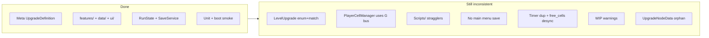
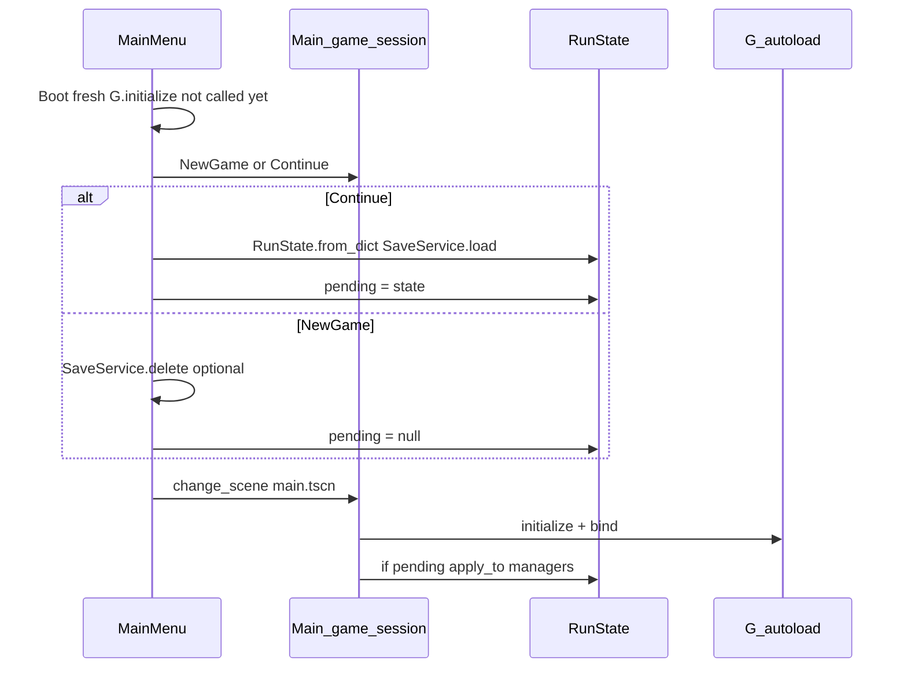

# Final Cleanup Refactor — Last Pass Before Features

## Goal

Move from "structurally refactored" to **clean and enforceable**: one pattern per concern, no WIP warnings in normal play, production save flow, docs that match reality, and automated guards against regression.

**Explicit non-goals** (defer to feature work):
- Implementing Wizard combat
- Expanding expedition reward types beyond wood
- Serializing the resource grid / buildings / timers (document as intentional)
- Redesigning level-upgrade scene trees (Phase 7 UI builder)

---

## Current gaps (summary)



---

## Phase 1 — Physical consolidation and dead code (1 PR)

**Move files to match target layout** (update autoload + all `preload` paths; open scenes once in editor):

| From | To |
|------|-----|
| [`Scripts/g.gd`](Scripts/g.gd) | [`core/g.gd`](core/g.gd) — update `[autoload]` in [`project.godot`](project.godot) |
| [`Scripts/displayable_timer.gd`](Scripts/displayable_timer.gd) | [`features/timers/displayable_timer.gd`](features/timers/displayable_timer.gd) |
| [`Scripts/hit_circle.gd`](Scripts/hit_circle.gd) | [`features/combat/hit_circle.gd`](features/combat/hit_circle.gd) |
| [`Scripts/effect_manager.gd`](Scripts/effect_manager.gd) | [`features/resource_grid/effect_manager.gd`](features/resource_grid/effect_manager.gd) |

Delete empty `Scripts/` folder.

**Remove orphans:**
- Delete [`data/upgrades/_scr_upgrade_node_data.gd`](data/upgrades/_scr_upgrade_node_data.gd) (`UpgradeNodeData` — zero references)

**Resolve stale TODOs** (small, targeted fixes only):
- [`features/resource_grid/cell_resource/cell_resource.gd`](features/resource_grid/cell_resource.gd) — remove stale `effect_timers` TODO if already implemented
- [`features/resource_grid/cell_combat_resolver.gd`](features/resource_grid/cell_combat_resolver.gd) — fix `_award_resources_for_hit` type inconsistency or add a one-line typed cast + comment if the fix is trivial

---

## Phase 2 — Enforce conventions in gameplay (1 PR)

### 2a. Decouple tower selection from `G`

Today [`features/towers/player_cell_manager.gd`](features/towers/player_cell_manager.gd) listens/emits on `G` for level-upgrade menu coordination. Refactor to **domain signals on `PlayerCellManager`**:

```gdscript
# PlayerCellManager (new)
signal tower_pressed(cell: PlayerCell)
signal tower_selection_cleared()
signal level_upgrade_requested(cell: PlayerCell)
```

- [`features/towers/player_cell/player_cell.gd`](features/towers/player_cell/player_cell.gd): emit `manager.tower_pressed.emit(self)` instead of `G.player_cell_pressed`
- `PlayerCellManager`: own highlight logic; emit `level_upgrade_requested` / `tower_selection_cleared`; accept `is_menu_blocking: Callable` or `menu_router` ref injected from `Game` to replace `G.opened_menu_type` check (injected bool callback is smallest change)
- [`Scenes/Game/game.gd`](Scenes/Game/game.gd): single bridge wiring `PlayerCellManager` domain signals ↔ `G.level_upgrade_menu_*` bus

### 2b. Harden UI wiring

- [`ui/main_hud/ui.gd`](ui/main_hud/ui.gd): add `get_upgrade_menu() -> UpgradeMenu` instead of `G.ui.get_node("CanvasLayer/UpgradeMenu")` in [`game.gd`](Scenes/Game/game.gd) and [`main.gd`](Scenes/Main/main.gd)
- [`ui/shared/animated_button/animated_button.gd`](ui/shared/animated_button/animated_button.gd): optional `label_factory` via `setup()` from parent; fall back to `G.ui` only in debug with a warning — or inject from `ButtonContainer` hosts

### 2c. Architecture lint test

Add [`tests/architecture_lint.gd`](tests/architecture_lint.gd) run from [`tests/run_tests.gd`](tests/run_tests.gd):

- **Fail** if `G.` appears under `features/` except an explicit allowlist file (start empty; goal is zero)
- **Fail** if `res://Scripts/` or `res://Resources/` paths exist
- **Fail** if `static var` appears outside `core/` save helpers and known static factories

This makes structure enforceable in CI / pre-push.

---

## Phase 3 — Level upgrades: full data migration (2–3 PRs)

Unify with meta upgrades using the same [`UpgradeDefinition`](data/upgrades/_scr_upgrade_definition.gd) shape. Keep scene-tree UI frozen per [`docs/CONVENTIONS.md`](docs/CONVENTIONS.md).

### 3a. Cell-scoped effect types

Add `data/upgrades/effects/level/` with a base script and one subclass per current match arm in [`level_upgrade_manager.gd`](features/towers/level_upgrade_manager.gd):

```gdscript
# data/upgrades/effects/level/_scr_level_upgrade_effect.gd
class_name LevelUpgradeEffect
extends UpgradeEffect
func apply_to_cell(cell: PlayerCell) -> void: pass
```

Examples (map 1:1 from existing match):
- `LevelUpgradeEffectAddWeakeningChance` (+amount)
- `LevelUpgradeEffectSetRicochetIfWeakened` (bool)
- `LevelUpgradeEffectAddBonusAttacks` (+amount)
- `LevelUpgradeEffectAddSpreadHeal` (ratio + targets)
- `LevelUpgradeEffectAddCellHitDamage` (wraps `DamageManager.add_hit_hp` on `cell.bonus_damage`)
- … (~12–15 small effect scripts; compound upgrades = multiple effects in one `.tres`)

Remove dead enum values: `SHOOTER_DPS_5`, `SHOOTER_DPS_6`, `SHOOTER_SUP_4`, `SHOOTER_SUP_5`, `SHOOTER_SUP_6`.

### 3b. Level upgrade definitions

- Create `data/upgrades/level/*.tres` — one per live `LevelUpgradeManager.Types` value (~21 files)
- Each `.tres`: `id` = enum int, `description`, `effects` array of `LevelUpgradeEffect` resources
- [`LevelUpgradeManager`](features/towers/level_upgrade_manager.gd) becomes thin:
  - `setup()` scans `data/upgrades/level/` (auto-discovery, same as meta batch 5 below)
  - `apply(type, cell)` → load definition → `LevelUpgradeApplier.apply(def, cell)`
  - `apply_for_load(type, cell)` → same without signals
  - `get_description(type)` → from definition
  - **Delete** `descriptions` dict and all `_apply_*_upgrade` match blocks

New file: [`features/towers/level_upgrade_applier.gd`](features/towers/level_upgrade_applier.gd) — iterates `def.effects`, calls `apply_to_cell`.

### 3c. Save compatibility

[`PlayerCellManager.to_save_dict`](features/towers/player_cell_manager.gd) already saves `level_upgrades` as enum ints — **no save schema change** needed; restore path calls `level_upgrade_manager.apply_for_load` which now uses definitions.

### 3d. Verification

- Manual: purchase each shooter/druid/rogue path node once
- Save/load with level upgrades on towers
- Add [`tests/unit/test_level_upgrade_effect.gd`](tests/unit/test_level_upgrade_effect.gd) for 2–3 representative cell effects

---

## Phase 4 — Save system completion (1–2 PRs)

### 4a. RunState hardening

Extend [`core/run_state.gd`](core/run_state.gd):

```gdscript
const SAVE_VERSION: int = 1

func to_dict() -> Dictionary:
    return { "version": SAVE_VERSION, "economy": ..., "upgrades": ..., "tower_grid": ... }

static func apply_to(managers_dict) -> void  # single entry: restore_all + UI sync hooks
```

### 4b. Fix known load bugs

| Bug | Fix |
|-----|-----|
| `UpgradeEffectAddSpecialCellSpawnTimer` duplicates timers on load | In [`upgrade_applier.gd`](features/meta_upgrades/upgrade_applier.gd): `if for_load: return` for one-shot timer registration (timers re-derived from upgrade state + `timer_manager.reset_upgrade_timers()` baseline) — verify lumberjack/outpost timers still appear after load |
| `economy.free_cells` vs `PlayerCellManager.free_cells` desync | After `restore_tower_grid`, call new `PlayerCellManager.sync_free_cells_from_economy(economy)` that rebuilds pool from placed towers + `economy.get_resource(FREE_CELLS)` |

### 4c. Main menu (m5f)

New entry flow:



**Files:**
- New [`ui/main_menu/main_menu.tscn`](ui/main_menu/main_menu.tscn) + `main_menu.gd` — Continue (disabled if no save), New Game
- [`project.godot`](project.godot): `run/main_scene` → main menu
- [`Scenes/Main/main.gd`](Scenes/Main/main.gd): after `G.bind_scene_managers` completes (defer), check `RunState.consume_pending()` and call `apply_to`; never load without explicit pending flag
- Move debug save/load keys to remain in `main.gd` debug-only; production uses menu + optional in-game Save button on outer `UI` (Escape menu or small Save button — keep minimal)

### 4d. Document intentional save omissions

Update [`docs/CONVENTIONS.md`](docs/CONVENTIONS.md) save section:

| Saved | Not saved (by design) |
|-------|----------------------|
| Economy, meta upgrades, tower grid + per-cell level upgrades | Resource grid cells, building runtime state, timer elapsed, expedition session |

Grid respawns via `TimerManager` after load — acceptable for current idle scope.

---

## Phase 5 — UI and WIP cleanup (1 PR)

### 5a. Refactor `block_expensive`

[`features/meta_upgrades/upgrade_menu/upgrade_menu.gd`](features/meta_upgrades/upgrade_menu/upgrade_menu.gd):

- Extract affordability to [`features/meta_upgrades/upgrade_affordability.gd`](features/meta_upgrades/upgrade_affordability.gd) (pure function: `nodes dict + economy → { blocked nodes, unlock count }`)
- `UpgradeNode.can_afford(economy) -> bool` for single-node check
- Remove TODO comment; keep behavior identical

### 5b. Meta upgrade auto-discovery

Replace four `_DEFINITION_PATHS` arrays in [`upgrade_manager.gd`](features/meta_upgrades/upgrade_manager.gd) with `DirAccess` scan of `res://data/upgrades/meta/*.tres` — same pattern for `LevelUpgradeManager` level definitions.

### 5c. ExpeditionUI (minimal)

[`features/expeditions/expedition_ui/expedition_ui.gd`](features/expeditions/expedition_ui.gd):

- `_on_expedition_started`: set `progress_bar_hp.value = 1.0`, reset time bar; remove `push_warning`
- `_on_hp_changed`: already wired — verify max display
- If time tracking does not exist on `ExpeditionManager`, hide `ProgressBarTimeLeft` until feature work (no warning)

### 5d. Wizard (minimal)

- Remove `debug_add_wizard` InputMap action and handler from [`main.gd`](Scenes/Main/main.gd)
- Keep `WIZARD` in data for internal/debug placement only; document stub in [`ARCHITECTURE.md`](ARCHITECTURE.md)
- Ensure no production UI offers Wizard tower

---

## Phase 6 — Documentation and closure (1 PR)

**Update docs to final state** (remove all "Phase N" / "else Resources/" / "else Scenes/Domain" fallback language):

- [`docs/CONVENTIONS.md`](docs/CONVENTIONS.md) — folder map is current-only; save table; level upgrades use `data/upgrades/level/`; architecture lint command
- [`ARCHITECTURE.md`](ARCHITECTURE.md) — boot flow includes main menu; ownership table adds `MainMenu`, `LevelUpgradeApplier`
- Mark plan todo `m5f-menu-save` completed in [`.cursor/plans/architecture_refactor_plan_e7610b6a.plan.md`](.cursor/plans/architecture_refactor_plan_e7610b6a.plan.md)

**Definition of done checklist:**

- [ ] `godot --headless -s res://tests/run_tests.gd` passes (unit + boot smoke + architecture lint)
- [ ] Fresh game: main menu → New Game → playable
- [ ] Continue restores economy + upgrades + towers + level upgrades
- [ ] No `push_warning` WIP in normal expedition flow
- [ ] `grep G\. features/` returns zero (or only allowlisted bridge if unavoidable)
- [ ] `Scripts/` folder does not exist
- [ ] Adding meta upgrade = new `.tres` in `data/upgrades/meta/` only (no path array edit)
- [ ] Adding level upgrade = new `.tres` in `data/upgrades/level/` + scene node with matching `type` export

---

## Suggested PR order

| PR | Scope | Risk |
|----|-------|------|
| 1 | Phase 1 file moves + dead code | Low — path churn |
| 2 | Phase 2 signal hygiene + arch lint | Medium — touch selection flow |
| 3 | Phase 3a–b level effect scripts | Low — additive |
| 4 | Phase 3c level `.tres` + manager rewrite | High — test all talent paths |
| 5 | Phase 4 save fixes + main menu | Medium — boot flow change |
| 6 | Phase 5 UI/WIP + auto-discovery | Low |
| 7 | Phase 6 docs + plan close | None |

**Estimated total:** ~1.5–2.5 weeks for 2–3 devs, depending on level-upgrade `.tres` authoring pace.

---

## Risk notes

- **Level upgrade migration** is the largest item — migrate shooter tree first, then druid, then rogue; one PR per tower type if needed.
- **Timer load fix** must be play-tested with lumberjack unlock save/load specifically.
- **Main menu scene change** affects every developer's F5 flow — document in README or CONVENTIONS boot section.
