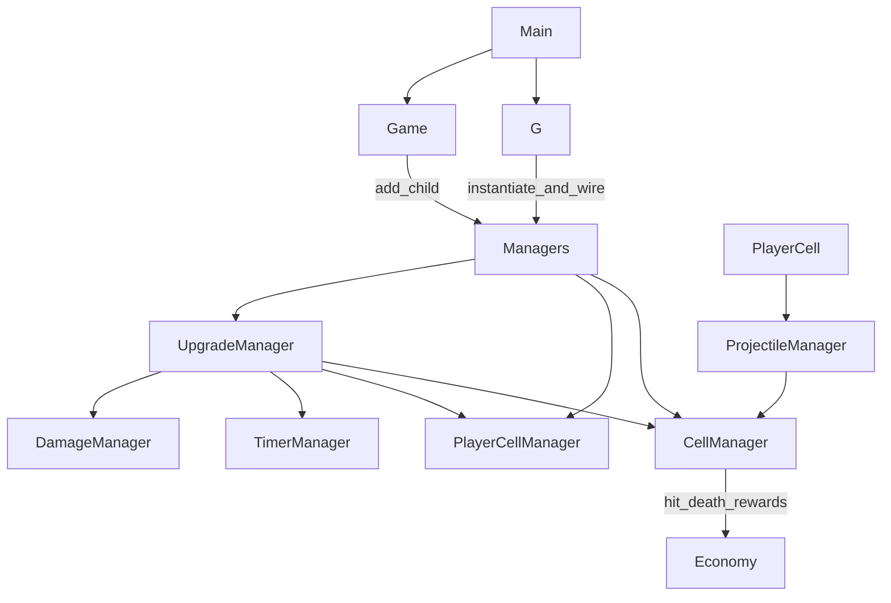

# Idle Prototype — Step-by-Step Refactor Plan

## Current pain (why this order)

The project already has the right *shape* (managers + Resources + scenes). Manageability breaks down in three places:

1. **Opaque boot** — [`Scripts/g.gd`](Scripts/g.gd) factories everything; [`Scenes/Game/game.gd`](Scenes/Game/game.gd) parents it. Scene tree in the editor does not match runtime.
2. **God scripts** — [`Scenes/CellManager/cell_manager.gd`](Scenes/CellManager/cell_manager.gd) (~677 lines: grid + combat resolve + specials + druid graph) and [`Scripts/upgrade_manager.gd`](Scripts/upgrade_manager.gd) (~341-line `match`).
3. **Hidden globals** — `static var` injection (`PlayerCell.manager`, `UpgradeNode.economy`, `Axe.bounce`, …) plus heavy `G.*` use for UI events.

**Default depth:** keep `G` as service locator + event bus. Do **not** introduce DI frameworks, strategy registries, or rewrite damage Dictionaries into full Resources unless a later step proves necessary. Abstractions only to serve behavior that already exists.

---

## Phase 0 — Hygiene (cheap, unlocks everything)

Do this first so later diffs are readable and `ExpeditionEditor` / loads do not fight you.

| Action | Why |
|--------|-----|
| Delete or quarantine unused stubs: [`Scripts/ui_manager.gd`](Scripts/ui_manager.gd) (empty), [`Scripts/test.gd`](Scripts/test.gd) if unused | Dead `class_name`s pollute global script cache |
| Keep [`Scripts/wip_stub.gd`](Scripts/wip_stub.gd) for now (still called from expedition/wizard) or replace call sites with `push_warning` and delete | One less fake manager |
| Rename folder `CelPlayer` → `PlayerCell` (update `.tscn` / UIDs carefully) | Naming consistency with `class_name PlayerCell` |
| Fix resource typo `cell_respirce_forest` if present | Avoid duplicate “mystery” assets |
| Replace opaque `load("uid://...")` in hot paths with `preload("res://...")` at file top for managers’ own scenes/data | Godot-friendly, searchable; keep UIDs only where Godot rewrites them in `.tscn` |
| Add a short `ARCHITECTURE.md` (1 page): boot order, who owns what, signal map | Future you (and agents) stop rediscovering `G.initialize` |

**ROI:** high / effort: low. No behavior change.

---

## Phase 1 — Make boot and ownership obvious

**Goal:** One place creates managers; one place parents them; `G` only holds refs + menu/UI signals.

### 1a. Clarify `G.initialize` vs `Game`

- Keep creation in `G.initialize()` **or** move scene-based managers into [`Scenes/Game/game.tscn`](Scenes/Game/game.tscn) as child nodes and assign `G.*` from `Game._ready`. Prefer **one** pattern, not both.
- **Chosen approach:** leave instantiation in `G` (least churn), but:
  - Group wiring into named helpers: `_create_economy()`, `_create_cell_systems()`, `_wire_upgrades()`, `_wire_combat()`.
  - Pass dependencies via instance vars / `initialize(deps)` instead of growing more `static var`s.
  - Document the runtime tree comment in `game.gd`.

### 1b. Stop growing static globals

When touching a type, replace static injection with explicit setup:

| Current | Prefer |
|---------|--------|
| `PlayerCell.manager` / `PlayerCell.projectile_manager` | Set on `PlayerCellManager` when configuring a cell, or pass into `PlayerCell.setup(...)` |
| `UpgradeNode.economy` / `.upgrade_manager` | Set when UpgradeMenu builds nodes |
| `TimerResource.cell_manager` | Pass into timer factory / TimerManager |
| `Axe.bounce` | Flag on `ProjectileData` or `ProjectileManager` |

Do **not** eradicate every `G.` call in phase 1—menus/tooltips via `G` signals are fine for a prototype.

### 1c. Menu / UI signal ownership

Keep open/close API on `G` (`toggle_menu`, etc.), but ensure UI listeners only live on [`Scenes/Main/ui.gd`](Scenes/Main/ui.gd) / [`Scenes/Game/uipp.gd`](Scenes/Game/uipp.gd). Avoid new gameplay systems emitting raw UI signals; emit domain signals (`expedition_ended`) and let UI react.

**ROI:** high / unlocks safe CellManager splits (clear deps).

---

## Phase 2 — Split `CellManager` (highest ROI script)

Carve by **existing function clusters** into sibling scripts under `Scenes/CellManager/`, composed by `CellManager` (composition, not deep inheritance). `ExpeditionEditor` extends `CellManager`—keep public grid API stable.

Suggested extractions (order matters):

### Step 2.1 — Grid & coords only (leave in `CellManager` or thin `CellGrid`)

Keep as the public façade:

- `cells`, `free_cells`, `occupied_*`, `get_cell_*`, `free_cell` / `occupy_cell` (core bookkeeping)
- Spawn entry points: `add_resource*`, `add_rand_resource*`, tier weights

### Step 2.2 — Extract hit/damage resolve → `cell_combat_resolver.gd` (RefCounted or Node child)

Move from current lines ~124–252:

- `_award_resources_for_hit`, `_apply_compiled_damage`, `_on_cell_hitted`, `get_cells_to_spread_damage`, `kill_grid` / `kill_cell`
- Keep emitting `CellManager` signals (`hit_handled`, `cell_died`) so callers unchanged

**Why first:** combat is the densest logic and does not need lumberjack/obelisk internals beyond calling public spawn/lvlup APIs.

### Step 2.3 — Extract special death / occupy hooks → `cell_special_behaviors.gd`

Move:

- `handle_cell_death_func` (lumberjack axe, outpost bullets)
- `_on_cell_occupied` specials
- `before_set_cell_data` lumberjack cap

Depends on `ProjectileManager` + grid APIs from 2.1–2.2.

### Step 2.4 — Extract druid obelisk graph → `druid_obelisk_system.gd`

Move:

- `obelisk_links`, `druid_obelisks`, `free_druid_obelisks`
- `_handle_druid_overheal_procs`, `handle_obelisk_buff`, `free_druid_obelisk`, related `free_cell` branches

**Stop here for CellManager.** Do not invent a generic “effect system” yet—[`Scripts/effect_manager.gd`](Scripts/effect_manager.gd) stays an enum until a third effect appears.

**Target:** `cell_manager.gd` ~200–300 lines of grid/spawn façade.

---

## Phase 3 — Thin `UpgradeManager` against new APIs

After CellManager/PlayerCellManager APIs are stable:

1. **Group the giant `match`** into private helpers by domain (no new classes yet):
   - `_apply_tower_upgrade`, `_apply_wood_upgrade`, `_apply_building_upgrade`, `_apply_projectile_upgrade`
2. Fix typos in enum (`BULLER_SPD`) when touching those arms.
3. Prefer calling **named methods** on managers (`cell_manager.add_cell_weight(...)`) over reaching into nested dicts from UpgradeManager—push mutation behind one-liners as you go.
4. Leave descriptions dict in place (or move to UpgradeNodeData later if editing in inspector becomes painful)—**not** a full data-driven upgrade framework.

[`Scripts/level_upgrade_manager.gd`](Scripts/level_upgrade_manager.gd) stays separate; only align naming/patterns with UpgradeManager helpers.

**ROI:** medium-high; becomes easy only after Phase 2 APIs exist.

---

## Phase 4 — Combat triangle consistency

Touches: [`Scenes/PlayerCell/player_cell.gd`](Scenes/PlayerCell/player_cell.gd), [`Scripts/projectile_manager.gd`](Scripts/projectile_manager.gd), [`Scripts/damage_manager.gd`](Scripts/damage_manager.gd), [`Scenes/Projectile/projectile.gd`](Scenes/Projectile/projectile.gd).

1. Resolve projectile_manager’s `# TODO: refactor effects` by keeping weakening on `ProjectileDataModifiers` (already exists)—just one code path in `new_projectile`.
2. Collapse duplicate `G.cell_manager` lookups in projectiles: pass `CellManager` into projectile setup once (from ProjectileManager).
3. Leave DamageManager Dictionary shape as-is for now; optionally add 2–3 helper methods where CellCombatResolver duplicated compile logic.
4. Trim `PlayerCell` instance flags only where level-up code already sets them—group related fields with a comment block; **do not** introduce a Modifiers Resource until a second tower needs the same blob.

---

## Phase 5 — Secondary managers & scenes (lighter pass)

| Area | Action |
|------|--------|
| [`Scripts/expedition_manager.gd`](Scripts/expedition_manager.gd) | Keep; route UI via domain signals; ensure `kill_grid` / `free_grid` / timer pause go through CellManager façade |
| [`Scenes/ExpeditionEditor/expedition_editor.gd`](Scenes/ExpeditionEditor/expedition_editor.gd) | After CellManager split, verify editor still sees `occupied_cells` / `cells`; avoid breaking inheritance |
| [`Scenes/TimerManager/`](Scenes/TimerManager/) | Remove `TimerResource.cell_manager` static when Phase 1b reaches it |
| [`Scenes/BuildingManager/`](Scenes/BuildingManager/) | Already small—only ensure UpgradeManager talks through BuildingManager API |
| [`Scripts/economy.gd`](Scripts/economy.gd) | Leave; already thin |
| UI menus | No structural rewrite; after Phase 1c, only fix direct `G` gameplay calls if found |

---

## Phase 6 — Polish (optional, low priority)

- Consistent `@export` / Resource data for spawn weights if you edit them often in inspector.
- Scene composition: eventually place CellManager / PlayerCellManager as children in `game.tscn` for editor visibility (behavior-preserving move).
- Remove debug hotkeys from [`Scenes/Main/main.gd`](Scenes/Main/main.gd) behind `OS.is_debug_build()` if they clutter.

---

## Suggested execution cadence

Each phase = one PR-sized chunk, playable after each:

1. Phase 0  
2. Phase 1 (boot helpers + stop new statics)  
3. Phase 2.1–2.2 (grid façade + combat extract) — **biggest playtest**  
4. Phase 2.3–2.4 (specials + obelisk)  
5. Phase 3 (UpgradeManager groups)  
6. Phase 4–5 as needed  

## Explicit non-goals (avoid overengineering)

- No ECS, no autoload-per-manager, no replacing `G` with a full event bus library.
- No rewriting all damage Dictionaries into Resources in one pass.
- No generic Upgrade Strategy pattern / JSON-driven upgrades until content volume forces it.
- No merging UpgradeManager + LevelUpgradeManager.
- Do not “perfect” EffectManager until a third effect ships.
